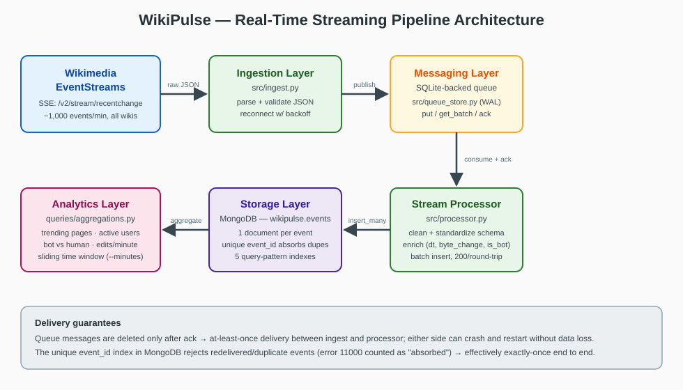

# WikiPulse — Real-Time Intelligence from Global Knowledge Edits

A real-time streaming pipeline that ingests live Wikipedia edit events from
Wikimedia EventStreams, processes them, and stores them in MongoDB for
near-real-time analytics (trending pages, most active users, bot vs human
activity, edit-frequency spikes).

## Architecture



```
Wikimedia EventStreams (SSE)
        │  https://stream.wikimedia.org/v2/stream/recentchange
        ▼
┌─────────────────┐     ┌──────────────────────┐     ┌──────────────────┐
│  src/ingest.py   │ --> │ SQLite-backed queue  │ --> │ src/processor.py │
│  ingestion layer │     │ (messaging layer,    │     │ clean, dedupe,   │
│  validate+parse  │     │  src/queue_store.py) │     │ enrich           │
└─────────────────┘     └──────────────────────┘     └────────┬─────────┘
                                                              ▼
                                              ┌────────────────────────┐
                                              │ MongoDB  wikipulse.events │
                                              └───────────┬────────────┘
                                                          ▼
                                              queries/aggregations.py
                                              (analytics layer)
```

The queue decouples ingestion from processing: either side can crash and
restart without losing events (messages are deleted only after an ack).
Delivery is at-least-once; the unique `event_id` index in MongoDB absorbs any
redelivered or duplicate events, making the pipeline effectively exactly-once.

## Setup

```bash
python -m venv .venv
.venv\Scripts\activate            # Windows  (Linux/macOS: source .venv/bin/activate)
pip install -r requirements.txt

docker compose up -d              # MongoDB on localhost:27017
python -m scripts.setup_indexes   # create the 5 indexes
```

No Docker? Point `WIKIPULSE_MONGO_URI` at any running MongoDB.

## Run

```bash
python -m src.ingest              # terminal 1: live stream -> queue
python -m src.processor           # terminal 2: queue -> MongoDB
python -m queries.aggregations --minutes 60   # analytics over last hour
```

## Offline smoke test (no network)

```bash
python -m scripts.replay_sample --count 500   # 499 unique + 1 duplicate
python -m src.processor --drain               # exits when queue is empty
python -m queries.aggregations --minutes 60
```

The processor must report `duplicates_absorbed=1` and MongoDB will hold 499
documents.

## Tests

```bash
python -m pytest tests/ -v        # 7 tests
```

## Data model

One document per event in `wikipulse.events` (event-based, not grouped):

| field | meaning |
|---|---|
| `event_id` | unique id from `meta.id` — dedup key |
| `type` | `edit` or `new` |
| `title`, `namespace` | page edited |
| `user`, `is_bot`, `minor` | who edited |
| `wiki`, `server_name` | which project |
| `dt` | event time (UTC datetime) |
| `byte_change` | `length.new - length.old` |
| `comment` | edit summary |

Event-based storage was chosen over pre-grouped rollups because the raw
events support any future aggregation, MongoDB aggregations over indexed time
windows are fast at this volume, and schema evolution stays trivial.

### Indexes (created by `scripts/setup_indexes.py`)

1. `event_id` (unique) — deduplication
2. `dt` — time-window queries
3. `user + dt` — per-user activity
4. `title + dt` — per-page / trending queries
5. `is_bot + dt` — bot vs human splits

## Configuration

All via environment variables: `WIKIPULSE_MONGO_URI`, `WIKIPULSE_MONGO_DB`,
`WIKIPULSE_MONGO_COLLECTION`, `WIKIPULSE_QUEUE_DB`, `WIKIPULSE_STREAM_URL`,
`WIKIPULSE_USER_AGENT`. Defaults work for a local MongoDB on port 27017.

## Design decisions & trade-offs

- **SQLite queue instead of Pub/Sub/Kafka**: zero-infrastructure local
  equivalent of the messaging layer; the QueueStore API (put/get_batch/ack)
  mirrors a real broker so swapping in Pub/Sub later only touches one module.
- **Dedup at the database** (unique index + error 11000 handling) rather than
  in-memory sets: survives restarts and works across multiple processors.
- **Batch inserts** (`insert_many`, unordered): one round trip per ~200
  events keeps processor latency low at stream rates (~30–100 events/s).
- **Scalability path**: run several processors against the same queue,
  shard MongoDB by `dt`, replace SQLite with Pub/Sub when going distributed.
